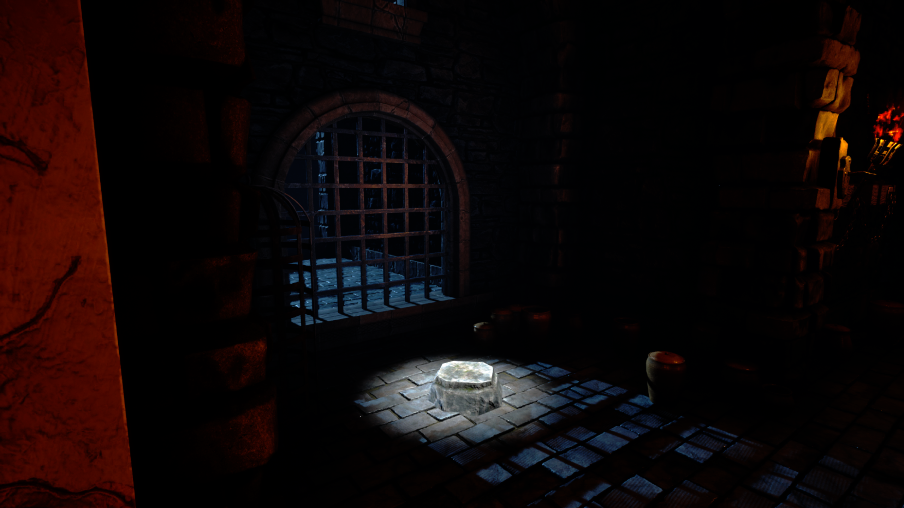

# Dungeon

> You have been trapped in a Dungeon. Try to solve the puzzles to find the golden figure to escape...

## Features
* **Feature 1:** E.g., Dynamic AI behavior and decision making.
* **Feature 2:** E.g., Custom high-quality 3D assets and environments.
* **Feature 3:** E.g., Built entirely using Unreal Engine 5 Blueprints (or C++) in the span of X days.

## Project Structure

This repository follows standard Unreal Engine folder conventions. Here is a breakdown of the project structure:

* **`Content/`** - The core folder containing all game assets.
  * **`MyStuff/`** - All parts made by the developer (no assets or music)
* **`Source/`** - Contains all C++ source code files (`.cpp` and `.h`).
* **`Config/`** - Default `.ini` files for input, engine, and game settings.
* **`Game/Windows`** - Contains .exe of the game + other related files
* **`Dungeon.uproject`** - The main Unreal Engine project file.

### To Play the Game:
1. Download the latest release.
2. Extract the `.zip` file.
3. Open the folder and run the executable: `Windows\[YourGameName].exe`

### To Open in Unreal Engine:
1. Clone or download this repository.
2. Ensure you have **Unreal Engine 5.x** installed.
3. Right-click the `[YourGameName].uproject` file and select **Generate Visual Studio project files** (if using C++).
4. Double-click the `[YourGameName].uproject` file to open it in the Unreal Editor.